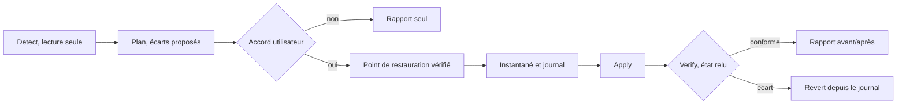

## Architecture technique

L'utilitaire est une application WPF sur .NET 10 LTS, lancée en administrateur, sans service résident ni pilote noyau. Chaque module suit le même contrat : Detect, Plan, Apply, Verify, Revert.

| Composant | Choix retenu | Justification |
|---|---|---|
| Environnement | .NET 10 LTS, C#, publication autonome x64 | Support jusqu'au 14 novembre 2028 ; .NET 8 s'arrête le 10 novembre 2026 ([source](https://dotnet.microsoft.com/en-us/platform/support/policy/dotnet-core)). Windows 10 22H2 grand public manque à la liste de support de .NET 10 ([source](https://github.com/dotnet/core/blob/main/release-notes/10.0/supported-os.md)) : fonctionnement à tester. |
| Interface | WPF, thème Fluent (`ThemeMode="System"`) | Thème Windows 11 clair et sombre depuis .NET 9 ([source](https://learn.microsoft.com/en-us/dotnet/desktop/wpf/whats-new/net90)). WinUI 3 écarté : une app packagée élevée exige Windows 11 ([source](https://github.com/microsoft/WindowsAppSDK/issues/896)), et l'élévation non packagée reste signalée non résolue ([source](https://github.com/microsoft/WindowsAppSDK/discussions/3038), à vérifier sur la version actuelle). |
| Élévation | Manifeste `requestedExecutionLevel level="requireAdministrator"` | Windows demande l'élévation au lancement ([source](https://learn.microsoft.com/en-us/cpp/build/reference/manifestuac-embeds-uac-information-in-manifest)). Si le compte élevé diffère de l'utilisateur de la session, les réglages HKCU et SPI (Modules 4, 6, 7) sont bloqués avec message. |
| Contrat de module | `Detect`, `Plan`, `Apply`, `Verify`, `Revert` | `Detect` et `Plan` n'écrivent jamais. `Verify` relit l'état effectif, car une stratégie peut être ignorée sur Famille (Module 4). |
| Profil matériel | Service commun, calculé une fois | Fixe ou portable, CPU, X3D, GPU, édition, build, PC géré : une seule règle pour les Modules 5, 7, 10 et 14. |
| Catalogue de règles | JSON versionné par build (19045, 26100, 26200, 28000) et par édition, signé | Mise à jour mensuelle. Signature détachée vérifiée par une clé publique embarquée ; repli sur le catalogue livré avec l'outil. |
| Instantané et journal | Un enregistrement par valeur : avant (ou absente), après, horodatage, module | Stockage sous `%ProgramData%\{Produit}\journal`, ACL SYSTEM et Administrateurs seulement. Un utilisateur standard ne doit pas pouvoir injecter une valeur que l'outil réécrirait en administrateur. |
| Point de restauration | WMI `root\default`, `SystemRestore.CreateRestorePoint(Description, 12, 100)` puis `101` | 12 = MODIFY_SETTINGS, 100 et 101 = début et fin de modification ([source](https://learn.microsoft.com/en-us/windows/win32/sr/createrestorepoint-systemrestore)). La classe `SystemRestore` sait aussi activer la protection ([source](https://learn.microsoft.com/en-us/windows/win32/sr/configuring-system-restore)). |
| Journalisation | JSON Lines tournant, 30 jours (choix de conception) | Sorties brutes de DISM, SFC et chkdsk conservées. Aucun nom d'utilisateur ni numéro de série. |
| Pilote noyau | Aucun embarqué | WinRing0 est signalé par Defender (Modules 10 et 11). PawnIO n'est utilisé que s'il est déjà installé. |
| Composants tiers | DiskSpd (MIT), LibreHardwareMonitor (MPL 2.0) | Avis de licence dans l'application. PawnIO (GPL 2.0) n'est jamais redistribué. |
| Signature | Artifact Signing (ex-Trusted Signing), certificat Public Trust | Service géré par Microsoft ([source](https://learn.microsoft.com/en-us/azure/artifact-signing/overview)), ouvert aux organisations de l'UE ; un développeur individuel doit résider aux États-Unis ou au Canada ([source](https://learn.microsoft.com/en-us/azure/artifact-signing/quickstart)). Dès 9,99 $ par mois ; un certificat EV ne contourne plus SmartScreen ([source](https://learn.microsoft.com/en-us/windows/apps/package-and-deploy/smartscreen-reputation)). |
| Distribution | Site HTTPS, manifeste winget, Microsoft Store à étudier | Le Store supprime l'avertissement SmartScreen ; ailleurs, la réputation demande plusieurs semaines ([source](https://learn.microsoft.com/en-us/windows/apps/package-and-deploy/smartscreen-reputation)). Smart App Control bloque les fichiers non signés sans réputation. |
| Mises à jour de l'outil | Vérification au lancement, installation après accord | Manifeste de version signé, téléchargement HTTPS. Aucune mise à jour silencieuse, aucun service résident. |

**Matrice de tests :** machines virtuelles Hyper-V propres pour les builds 19045, 26100 et 26200, en Famille, Pro et Entreprise, en français et en anglais. La build 28000 n'existe que sur une machine neuve livrée en 26H1 (Module 3). Les VM ne couvrent ni GPU, ni modes d'alimentation, ni XMP/EXPO, ni batterie, ni HDR.

**Parc physique :** fixe Intel 13e ou 14e génération, fixe Ryzen X3D double CCD, portables Modern Standby Intel et AMD, GPU NVIDIA, AMD et Intel Arc. Cas spéciaux : PC géré (Intune ou domaine), antivirus tiers, BitLocker actif, image modifiée (Tiny11), élévation par un autre compte.

**Critère d'acceptation :** après `Apply` puis `Revert`, un nouveau `Detect` doit montrer zéro écart avec l'instantané initial. Les faux positifs antivirus persistants se signalent sur le portail Microsoft Security Intelligence ([source](https://learn.microsoft.com/en-us/azure/artifact-signing/faq)).
